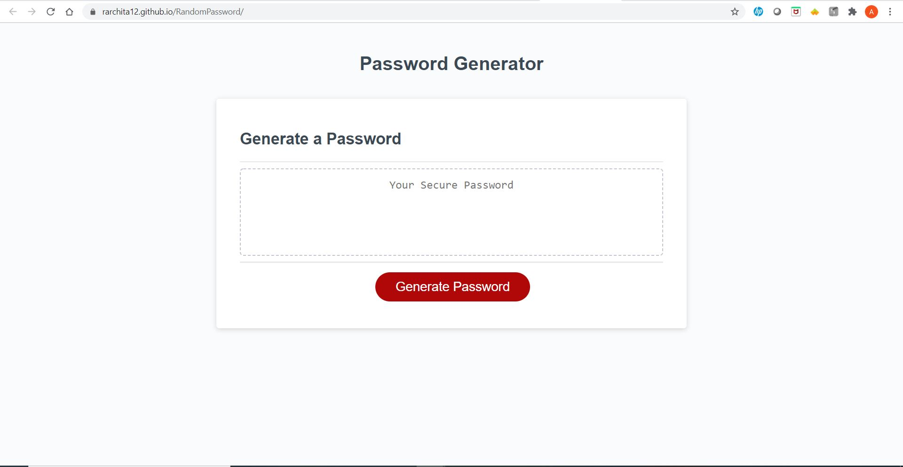
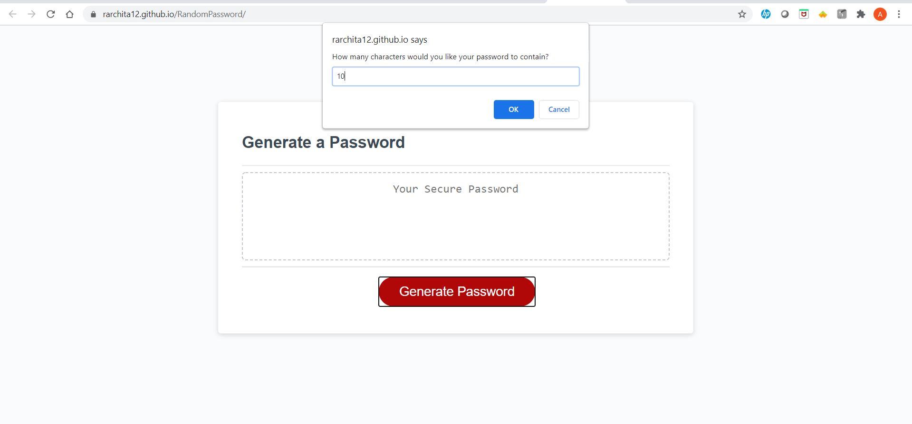
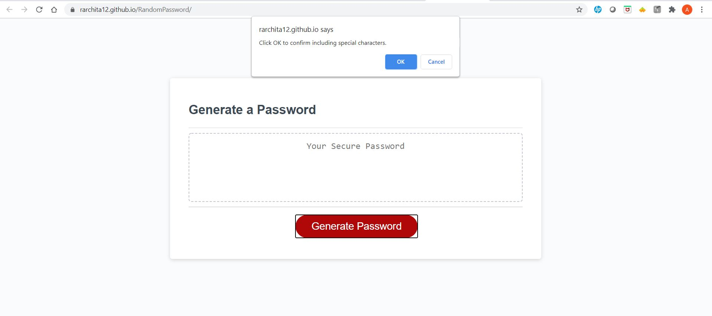
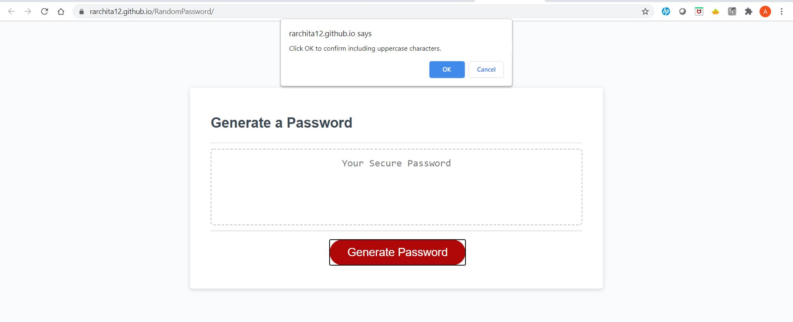
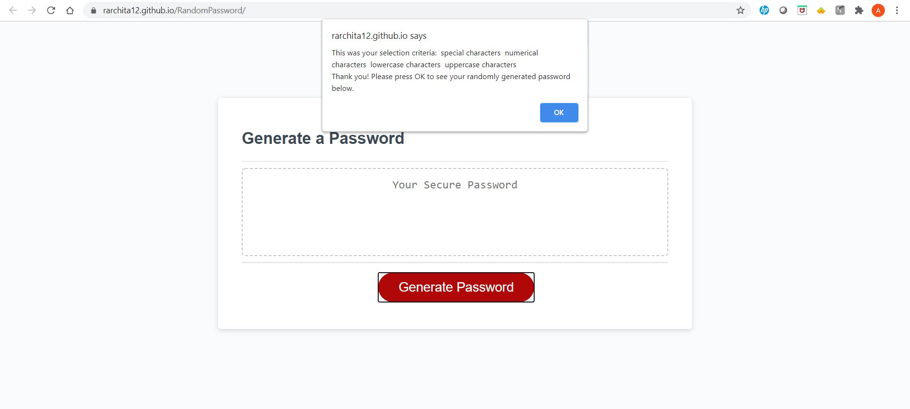
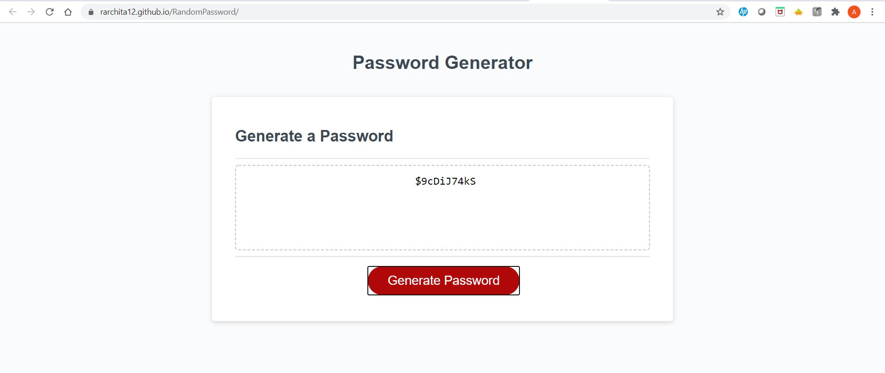

## Random Password Generator

## Purpose

This website generates a random password based on the user's input of their chosen password length, and if they want special, numerical, lowercase or uppercase characters to be included in their randomly generate password.

## Built With

- HTML
- CSS
- JavaScript

## Website

https://rarchita12.github.io/RandomPassword/

# Contribution

Made by Archita
